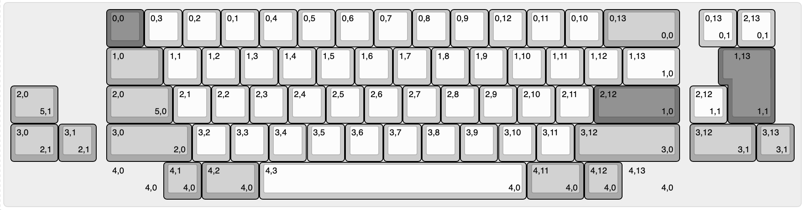

## Viper example

This is based on [Automated Keyboard PCB design with ergogen and kbplacer](https://github.com/adamws/kicad-kbplacer/tree/master/examples/absolem-ergogen).

## dev env

on linux
python3 -m venv .venv --system-site-packages
source .venv/bin/activate
pip install kbplacer
test kicad
python -c "import pcbnew; print(pcbnew.Version())"


## KLE & VIA Layout

Open with `cat viper_v1_via_url.txt|pbcopy` on mac & paste the url in your browser...

kbplacer can use via for switch placement & requires via for collapsing a KLE layout

VIA spec https://www.caniusevia.com/docs/layouts#overview uses KLE raw, but not kle.com's raw json
VIA spec based on [wt60_d](https://github.com/the-via/keyboards/blob/9da730d66a00c3ca1b9b9ac7e7078fc221432501/v3/wilba_tech/wt60_d/wt60_d.json#L9)

```
python -m kbplacer.kle_serial -in keyboard-layout-via.json -inform KLE_VIA -out keyboard-layout-collapsed.json -outform KLE_RAW -collapse
```

### KLE Raw, Expanded



```
[{x:2.5,c:"#777777"},"0,0",{c:"#cccccc"},"0,1","0,2","0,3","0,4","0,5","0,6","0,7","0,8","0,9","0,10","0,11","0,12",{c:"#aaaaaa",w:2},"0,13\n\n\n0,0",{x:0.5,c:"#cccccc"},"0,13\n\n\n0,1","2,13\n\n\n0,1"],
[{x:2.5,c:"#aaaaaa",w:1.5},"1,0",{c:"#cccccc"},"1,1","1,2","1,3","1,4","1,5","1,6","1,7","1,8","1,9","1,10","1,11","1,12",{w:1.5},"1,13\n\n\n1,0",{x:1.25,c:"#777777",w:1.25,h:2,w2:1.5,h2:1,x2:-0.25},"1,13\n\n\n1,1"],
[{c:"#aaaaaa",w:1.25},"2,0\n\n\n5,1",{x:1.25,w:1.75},"2,0\n\n\n5,0",{c:"#cccccc"},"2,1","2,2","2,3","2,4","2,5","2,6","2,7","2,8","2,9","2,10","2,11",{c:"#777777",w:2.25},"2,12\n\n\n1,0",{x:0.25,c:"#cccccc"},"2,12\n\n\n1,1"],
[{c:"#aaaaaa",w:1.25},"3,0\n\n\n2,1","3,1\n\n\n2,1",{x:0.25,w:2.25},"3,0\n\n\n2,0",{c:"#cccccc"},"3,2","3,3","3,4","3,5","3,6","3,7","3,8","3,9","3,10","3,11",{c:"#aaaaaa",w:2.75},"3,12\n\n\n3,0",{x:0.25,w:1.75},"3,12\n\n\n3,1","3,13\n\n\n3,1"],
[{x:2.5,w:1.5,d:true},"4,0\n\n\n4,0","4,1\n\n\n4,0",{w:1.5},"4,2\n\n\n4,0",{c:"#cccccc",w:7},"4,3\n\n\n4,0",{c:"#aaaaaa",w:1.5},"4,11\n\n\n4,0","4,12\n\n\n4,0",{w:1.5,d:true},"4,13\n\n\n4,0"]
```
```
https://keyboard-layout-editor.com/##@@_x:2.5&c=%23777777%3B&=0,0&_c=%23cccccc%3B&=0,1&=0,2&=0,3&=0,4&=0,5&=0,6&=0,7&=0,8&=0,9&=0,10&=0,11&=0,12&_c=%23aaaaaa&w:2%3B&=0,13%0A%0A%0A0,0&_x:0.5&c=%23cccccc%3B&=0,13%0A%0A%0A0,1&=2,13%0A%0A%0A0,1%3B&@_x:2.5&c=%23aaaaaa&w:1.5%3B&=1,0&_c=%23cccccc%3B&=1,1&=1,2&=1,3&=1,4&=1,5&=1,6&=1,7&=1,8&=1,9&=1,10&=1,11&=1,12&_w:1.5%3B&=1,13%0A%0A%0A1,0&_x:1.25&c=%23777777&w:1.25&h:2&w2:1.5&h2:1&x2:-0.25%3B&=1,13%0A%0A%0A1,1%3B&@_c=%23aaaaaa&w:1.25%3B&=2,0%0A%0A%0A5,1&_x:1.25&w:1.75%3B&=2,0%0A%0A%0A5,0&_c=%23cccccc%3B&=2,1&=2,2&=2,3&=2,4&=2,5&=2,6&=2,7&=2,8&=2,9&=2,10&=2,11&_c=%23777777&w:2.25%3B&=2,12%0A%0A%0A1,0&_x:0.25&c=%23cccccc%3B&=2,12%0A%0A%0A1,1%3B&@_c=%23aaaaaa&w:1.25%3B&=3,0%0A%0A%0A2,1&=3,1%0A%0A%0A2,1&_x:0.25&w:2.25%3B&=3,0%0A%0A%0A2,0&_c=%23cccccc%3B&=3,2&=3,3&=3,4&=3,5&=3,6&=3,7&=3,8&=3,9&=3,10&=3,11&_c=%23aaaaaa&w:2.75%3B&=3,12%0A%0A%0A3,0&_x:0.25&w:1.75%3B&=3,12%0A%0A%0A3,1&=3,13%0A%0A%0A3,1%3B&@_x:2.5&w:1.5&d:true%3B&=4,0%0A%0A%0A4,0&=4,1%0A%0A%0A4,0&_w:1.5%3B&=4,2%0A%0A%0A4,0&_c=%23cccccc&w:7%3B&=4,3%0A%0A%0A4,0&_c=%23aaaaaa&w:1.5%3B&=4,11%0A%0A%0A4,0&=4,12%0A%0A%0A4,0&_w:1.5&d:true%3B&=4,13%0A%0A%0A4,0
```

### KLE Raw, Collapsed


```
[{x:2.5,c:"#777777"},"0,0",{c:"#cccccc"},"0,1","0,2","0,3","0,4","0,5","0,6","0,7","0,8","0,9","0,10","0,11","0,12",{c:"#aaaaaa",w:2},"0,13\n\n\n0,0",{x:-2,c:"#cccccc"},"0,13\n\n\n0,1","2,13\n\n\n0,1"],
[{x:2.5,c:"#aaaaaa",w:1.5},"1,0",{c:"#cccccc"},"1,1","1,2","1,3","1,4","1,5","1,6","1,7","1,8","1,9","1,10","1,11","1,12",{w:1.5},"1,13\n\n\n1,0",{x:-1.25,c:"#777777",w:1.25,h:2,w2:1.5,h2:1,x2:-0.25},"1,13\n\n\n1,1"],
[{x:2.5,c:"#aaaaaa",w:1.75},"2,0\n\n\n5,0",{x:-1.75,w:1.25},"2,0\n\n\n5,1",{x:0.5,c:"#cccccc"},"2,1","2,2","2,3","2,4","2,5","2,6","2,7","2,8","2,9","2,10","2,11",{c:"#777777",w:2.25},"2,12\n\n\n1,0",{x:-2.25,c:"#cccccc"},"2,12\n\n\n1,1"],
[{x:2.5,c:"#aaaaaa",w:2.25},"3,0\n\n\n2,0",{x:-2.25,w:1.25},"3,0\n\n\n2,1","3,1\n\n\n2,1",{c:"#cccccc"},"3,2","3,3","3,4","3,5","3,6","3,7","3,8","3,9","3,10","3,11",{c:"#aaaaaa",w:2.75},"3,12\n\n\n3,0",{x:-2.75,w:1.75},"3,12\n\n\n3,1","3,13\n\n\n3,1"],
[{x:4},"4,1\n\n\n4,0",{w:1.5},"4,2\n\n\n4,0",{c:"#cccccc",w:7},"4,3\n\n\n4,0",{c:"#aaaaaa",w:1.5},"4,11\n\n\n4,0","4,12\n\n\n4,0"]
```

```
https://www.keyboard-layout-editor.com/##@@_x:2.5&c=%23777777%3B&=0,0&_c=%23cccccc%3B&=0,1&=0,2&=0,3&=0,4&=0,5&=0,6&=0,7&=0,8&=0,9&=0,10&=0,11&=0,12&_c=%23aaaaaa&w:2%3B&=0,13%0A%0A%0A0,0&_x:-2&c=%23cccccc%3B&=0,13%0A%0A%0A0,1&=2,13%0A%0A%0A0,1%3B&@_x:2.5&c=%23aaaaaa&w:1.5%3B&=1,0&_c=%23cccccc%3B&=1,1&=1,2&=1,3&=1,4&=1,5&=1,6&=1,7&=1,8&=1,9&=1,10&=1,11&=1,12&_w:1.5%3B&=1,13%0A%0A%0A1,0&_x:-1.25&c=%23777777&w:1.25&h:2&w2:1.5&h2:1&x2:-0.25%3B&=1,13%0A%0A%0A1,1%3B&@_x:2.5&c=%23aaaaaa&w:1.75%3B&=2,0%0A%0A%0A5,0&_x:-1.75&w:1.25%3B&=2,0%0A%0A%0A5,1&_x:0.5&c=%23cccccc%3B&=2,1&=2,2&=2,3&=2,4&=2,5&=2,6&=2,7&=2,8&=2,9&=2,10&=2,11&_c=%23777777&w:2.25%3B&=2,12%0A%0A%0A1,0&_x:-2.25&c=%23cccccc%3B&=2,12%0A%0A%0A1,1%3B&@_x:2.5&c=%23aaaaaa&w:2.25%3B&=3,0%0A%0A%0A2,0&_x:-2.25&w:1.25%3B&=3,0%0A%0A%0A2,1&=3,1%0A%0A%0A2,1&_c=%23cccccc%3B&=3,2&=3,3&=3,4&=3,5&=3,6&=3,7&=3,8&=3,9&=3,10&=3,11&_c=%23aaaaaa&w:2.75%3B&=3,12%0A%0A%0A3,0&_x:-2.75&w:1.75%3B&=3,12%0A%0A%0A3,1&=3,13%0A%0A%0A3,1%3B&@_x:4%3B&=4,1%0A%0A%0A4,0&_w:1.5%3B&=4,2%0A%0A%0A4,0&_c=%23cccccc&w:7%3B&=4,3%0A%0A%0A4,0&_c=%23aaaaaa&w:1.5%3B&=4,11%0A%0A%0A4,0&=4,12%0A%0A%0A4,0
```

- Forked [duck_viper](https://adamws.github.io/keyboard-pcbs/#duck-eagle_viper-v2-eagle_viper)
- - Removed ANSI bottom row
- - Assigned VIA option 4,0 to HHKB bottom row for optional HHKB split later

## Build with Docker

`sed -i.bak 's/absolem/viper/g' Dockerfile run.sh`

Changed Dockerfile

./run

