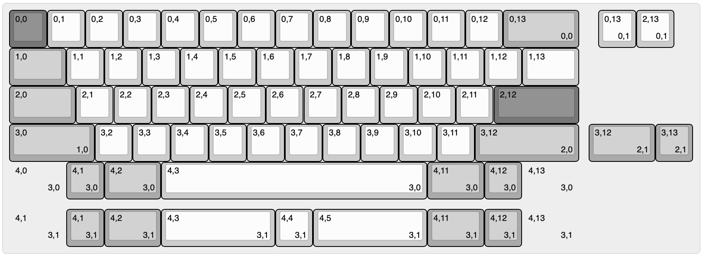

# Duck Viper v1 PCB - Open Source Upgrade

⚠️ **Work in Progress** - This project is currently under development




## Overview

An open-source PCB design for the Duck Viper v1 keyboard with hardware upgrades. This project focuses on transparency and community collaboration while building upon existing open-source resources.

**Disclaimer:** I'm not an electrical engineer - this project represents my attempt at "putting the parts together" using available community resources, guides, and libraries. Community feedback and contributions are greatly appreciated!

(Planned *) Upgrades: 
- USB-C Connector
- ESD
- Separate Caps Lock LED
- - RGB Underglow *
- - Additional switches for Split HHKB Bottom Row *
- - MXLockLed *

## Design Philosophy

- **Open Source First**: All design files, schematics, and documentation will be freely available
- **Community Driven**: Built using existing open-source libraries and community knowledge
- **Transparency**: Design decisions and trade-offs documented for others to learn from

## Current Status

<p align="left">
  
</p>


### Design Questions (Help Needed!)

**1. QFN vs QFP Package Decision**
- **QFN Pros**: Required for split HHKB layout with IC positioned between Caps Lock and A (see Voyager60 reference)
- **QFN Cons**: Hand soldering difficulty increases prototype cost (~$20 per PCB for 5-unit orders with just an assembled QFN IC vs ~$10 for 5 PCBs ex. assembly)
- **QFP**: Easier to hand solder but may not fit desired layout constraints due to additional stabilizer requirements for split HHKB

QFN IC placement mock-up:


*If going QFN route, schematic verification help would be greatly appreciated!*

## Acknowledgments

This project builds upon the incredible work of the open-source keyboard community. Specific libraries, guides, and resources used will be documented as the project progresses.

## Contributing

As a learning project, I welcome:
- Schematic reviews and feedback
- Design suggestions and improvements  
- Documentation contributions
- Testing and validation help

## Supported Layouts

kbplacer can use via for switch placement & requires via for collapsing a KLE layout

VIA spec https://www.caniusevia.com/docs/layouts#overview uses KLE raw, but not kle.com's raw json
VIA spec based on [wt60_d](https://github.com/the-via/keyboards/blob/9da730d66a00c3ca1b9b9ac7e7078fc221432501/v3/wilba_tech/wt60_d/wt60_d.json#L9)


```
python -m kbplacer.kle_serial -in keyboard-layout-via.json -inform KLE_VIA -out keyboard-layout-collapsed.json -outform KLE_RAW -collapse
```

- Forked [duck_viper](https://adamws.github.io/keyboard-pcbs/#duck-eagle_viper-v2-eagle_viper)

### HHKB

**Standard HHKB**: Traditional Happy Hacking Keyboard layout 


<details>
<summary>KLE Raw data</summary>

```
[{c:"#777777"},"0,0",{c:"#cccccc"},"0,1","0,2","0,3","0,4","0,5","0,6","0,7","0,8","0,9","0,10","0,11","0,12",{c:"#aaaaaa",w:2},"0,13\n\n\n0,0",{x:0.5,c:"#cccccc"},"0,13\n\n\n0,1","2,13\n\n\n0,1"],
[{c:"#aaaaaa",w:1.5},"1,0",{c:"#cccccc"},"1,1","1,2","1,3","1,4","1,5","1,6","1,7","1,8","1,9","1,10","1,11","1,12",{w:1.5},"1,13"],
[{c:"#aaaaaa",w:1.75},"2,0",{c:"#cccccc"},"2,1","2,2","2,3","2,4","2,5","2,6","2,7","2,8","2,9","2,10","2,11",{c:"#777777",w:2.25},"2,12"],
[{c:"#aaaaaa",w:2.25},"3,0\n\n\n1,0",{c:"#cccccc"},"3,2","3,3","3,4","3,5","3,6","3,7","3,8","3,9","3,10","3,11",{c:"#aaaaaa",w:2.75},"3,12\n\n\n2,0",{x:0.25,w:1.75},"3,12\n\n\n2,1","3,13\n\n\n2,1"],
[{w:1.5,d:true},"4,0\n\n\n3,0","4,1\n\n\n3,0",{w:1.5},"4,2\n\n\n3,0",{c:"#cccccc",w:7},"4,3\n\n\n3,0",{c:"#aaaaaa",w:1.5},"4,11\n\n\n3,0","4,12\n\n\n3,0",{w:1.5,d:true},"4,13\n\n\n3,0"]
```
</details>


<details>
<summary>KLE Raw data</summary>

```
[{c:"#777777"},"0,0",{c:"#cccccc"},"0,1","0,2","0,3","0,4","0,5","0,6","0,7","0,8","0,9","0,10","0,11","0,12",{c:"#aaaaaa",w:2},"0,13\n\n\n0,0",{x:-2,c:"#cccccc"},"0,13\n\n\n0,1","2,13\n\n\n0,1"],
[{c:"#aaaaaa",w:1.5},"1,0",{c:"#cccccc"},"1,1","1,2","1,3","1,4","1,5","1,6","1,7","1,8","1,9","1,10","1,11","1,12",{w:1.5},"1,13"],
[{c:"#aaaaaa",w:1.75},"2,0",{c:"#cccccc"},"2,1","2,2","2,3","2,4","2,5","2,6","2,7","2,8","2,9","2,10","2,11",{c:"#777777",w:2.25},"2,12"],
[{c:"#aaaaaa",w:2.25},"3,0\n\n\n1,0",{c:"#cccccc"},"3,2","3,3","3,4","3,5","3,6","3,7","3,8","3,9","3,10","3,11",{c:"#aaaaaa",w:2.75},"3,12\n\n\n2,0",{x:-2.75,w:1.75},"3,12\n\n\n2,1","3,13\n\n\n2,1"],
[{x:1.5},"4,1\n\n\n3,0",{w:1.5},"4,2\n\n\n3,0",{c:"#cccccc",w:7},"4,3\n\n\n3,0",{x:-7,w:3},"4,3\n\n\n3,1","4,4\n\n\n3,1",{w:3},"4,5\n\n\n3,1",{c:"#aaaaaa",w:1.5},"4,11\n\n\n3,0","4,12\n\n\n3,0"]
```
</details>

### Split HHKB

**Split HHKB**: Split layout variant requiring QFN package for compact IC placement


<details>
<summary>KLE Raw data</summary>

```
[{c:"#777777"},"0,0",{c:"#cccccc"},"0,1","0,2","0,3","0,4","0,5","0,6","0,7","0,8","0,9","0,10","0,11","0,12",{c:"#aaaaaa",w:2},"0,13\n\n\n0,0",{x:0.5,c:"#cccccc"},"0,13\n\n\n0,1","2,13\n\n\n0,1"],
[{c:"#aaaaaa",w:1.5},"1,0",{c:"#cccccc"},"1,1","1,2","1,3","1,4","1,5","1,6","1,7","1,8","1,9","1,10","1,11","1,12",{w:1.5},"1,13"],
[{c:"#aaaaaa",w:1.75},"2,0",{c:"#cccccc"},"2,1","2,2","2,3","2,4","2,5","2,6","2,7","2,8","2,9","2,10","2,11",{c:"#777777",w:2.25},"2,12"],
[{c:"#aaaaaa",w:2.25},"3,0\n\n\n1,0",{c:"#cccccc"},"3,2","3,3","3,4","3,5","3,6","3,7","3,8","3,9","3,10","3,11",{c:"#aaaaaa",w:2.75},"3,12\n\n\n2,0",{x:0.25,w:1.75},"3,12\n\n\n2,1","3,13\n\n\n2,1"],
[{w:1.5,d:true},"4,0\n\n\n3,0","4,1\n\n\n3,0",{w:1.5},"4,2\n\n\n3,0",{c:"#cccccc",w:7},"4,3\n\n\n3,0",{c:"#aaaaaa",w:1.5},"4,11\n\n\n3,0","4,12\n\n\n3,0",{w:1.5,d:true},"4,13\n\n\n3,0"],
[{y:0.25,w:1.5,d:true},"4,0\n\n\n3,1","4,1\n\n\n3,1",{w:1.5},"4,2\n\n\n3,1",{c:"#cccccc",w:3},"4,3\n\n\n3,1","4,4\n\n\n3,1",{w:3},"4,5\n\n\n3,1",{c:"#aaaaaa",w:1.5},"4,11\n\n\n3,1","4,12\n\n\n3,1",{c:"#cccccc",w:1.5,d:true},"4,13\n\n\n3,1"]
```
</details>


<details>
<summary>KLE Raw data</summary>

```
[{c:"#777777"},"0,0",{c:"#cccccc"},"0,1","0,2","0,3","0,4","0,5","0,6","0,7","0,8","0,9","0,10","0,11","0,12",{c:"#aaaaaa",w:2},"0,13\n\n\n0,0",{x:-2,c:"#cccccc"},"0,13\n\n\n0,1","2,13\n\n\n0,1"],
[{c:"#aaaaaa",w:1.5},"1,0",{c:"#cccccc"},"1,1","1,2","1,3","1,4","1,5","1,6","1,7","1,8","1,9","1,10","1,11","1,12",{w:1.5},"1,13"],
[{c:"#aaaaaa",w:1.75},"2,0",{c:"#cccccc"},"2,1","2,2","2,3","2,4","2,5","2,6","2,7","2,8","2,9","2,10","2,11",{c:"#777777",w:2.25},"2,12"],
[{c:"#aaaaaa",w:2.25},"3,0\n\n\n1,0",{c:"#cccccc"},"3,2","3,3","3,4","3,5","3,6","3,7","3,8","3,9","3,10","3,11",{c:"#aaaaaa",w:2.75},"3,12\n\n\n2,0",{x:-2.75,w:1.75},"3,12\n\n\n2,1","3,13\n\n\n2,1"],
[{x:1.5},"4,1\n\n\n3,0",{w:1.5},"4,2\n\n\n3,0",{c:"#cccccc",w:7},"4,3\n\n\n3,0",{x:-7,w:3},"4,3\n\n\n3,1","4,4\n\n\n3,1",{w:3},"4,5\n\n\n3,1",{c:"#aaaaaa",w:1.5},"4,11\n\n\n3,0","4,12\n\n\n3,0"]
```
</details>

## Development Environment Setup

### Hardware Design (KiCad)

**Requirements:**
- KiCad 9.0 or later
- Git for version control
- - python3
- - docker

**Setup:**
```bash
# Clone the repository
git clone [repository-url]
cd duck-viper-v1-pcb

# Open the project in KiCad
# File -> Open Project -> duck-viper-v1.kicad_pro
```

**Setup for adamws/kbplacer:**
```bash
# Clone the repository
git clone [repository-url]
cd duck-viper-v1-pcb
python3 -m venv .venv
source .venv/bin/activate
python3 -m pip install .

python -m kbplacer.kle_serial -in kle/keyboard-layout-via.json -inform KLE_VIA -out kle/keyboard-layout-collapsed.json -outform KLE_INTERNAL -collapse
python tools/layout2url.py -in keyboard-layout-collapsed.json|pbcopy

# Open the project in KiCad
# File -> Open Project -> duck-viper-v1.kicad_pro
```

**linux**
```bash
python3 -m venv .venv --system-site-packages
source .venv/bin/activate
pip install .

# test kicad
python -c "import pcbnew; print(pcbnew.Version())"
```

**Libraries Used:**
- [AcheronProject/AlexandriaLibrary](https://github.com/AcheronProject/AlexandriaLibrary)
- Community keyboard libraries (specific sources TBD)

### Firmware Development

*Detailed firmware setup instructions will be added as development progresses.*

### Manufacturing Files

Generation of Gerber files, pick-and-place files, and BOM will be documented once design is finalized.

## Thanks yo

This project is inspired by [Automated Keyboard PCB design with ergogen and kbplacer](https://github.com/adamws/kicad-kbplacer/tree/master/examples/absolem-ergogen). Still, it's far from being fully automated.

- adamws/kicad-kbplacer
- https://github.com/ruiqimao/keyboard-pcb-guide
- https://wiki.ai03.com/books/pcb-design
- https://github.com/evyd13/plain60-b
- https://github.com/evyd13/plain60-c
- https://www.masterzen.fr/2020/05/03/designing-a-keyboard-part-1/

## License

[MIT](LICENSE)

---

*This project is a learning exercise in PCB design. Use at your own risk and always verify designs before manufacturing.*